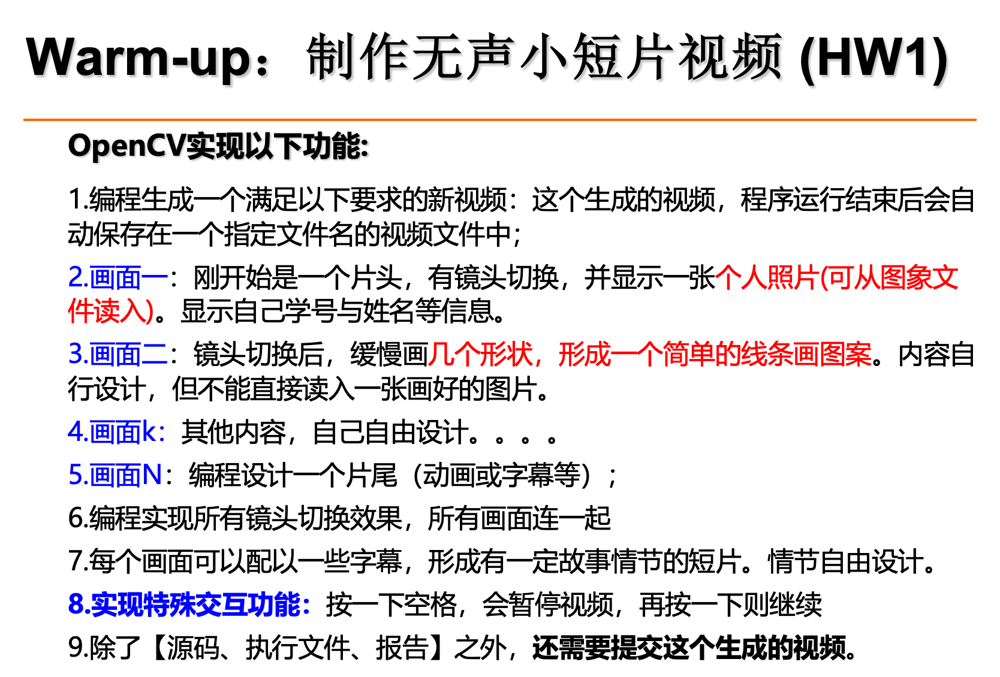
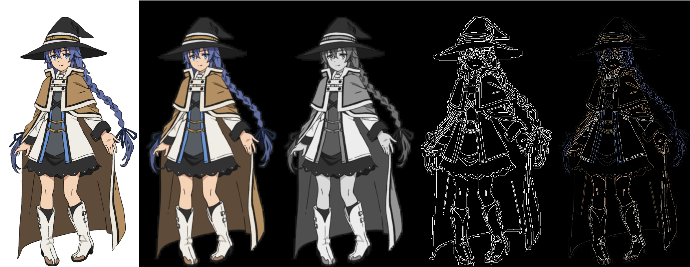
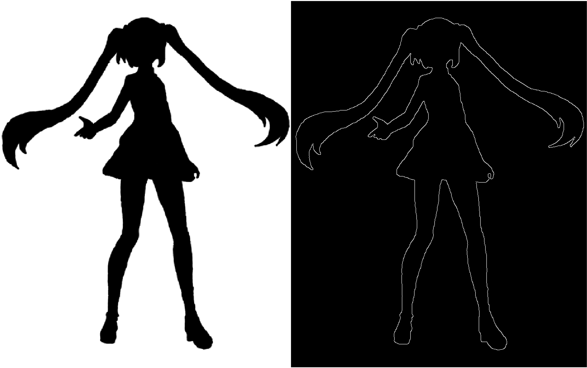

# HW1: 制作无声小短片视频

## 作业要求




## 运行

### 环境

```bash
python==3.9.18
opencv-python==4.10.0.84
numpy==1.26.4
```

### 运行

```bash
cd hw1
python main.py
```


## 实现

### 基本函数

```python
## show image and text
cv2.imshow(name, image)		# image
cv2.putText(image, text, position, font, scale, 
            color, thickness, line_type)		# text

## create and release video
fourcc = cv2.VideoWriter_fourcc(*'mp4v')
video = cv2.VideoWriter(output_path, fourcc, fps, size)
video.write(image)
video.release()
```

### 简笔画

1. 首先提取图片边缘

   用彩色图片展示，从左到右依次为：原图 --> GaussianBlurred --> Gray --> Canny Edge --> Colored Edge

   

   黑白图同理，只展示原图 --> Canny Edge

   

2. 获取轮廓并绘制

   使用cv2.findContours()获取轮廓并用cv2.line()连接连续点

### 空格键暂停

```python
def space_pause(self):
    if cv2.waitKey(30) & 0xFF == ord(' '):
        print("PAUSED!")
        cv2.waitKey(0)
        print("RESUME!")
```


## 附录：Animator类

```python
class Animator():
    def __init__(self, size=(1440,960), fps=30, name='video', output_path="./result.mp4", render=True) -> None:
        self.size = size
        self.fps = fps
        self.name = 'video'
        self.render = render

        fourcc = cv2.VideoWriter_fourcc(*'mp4v')
        self.video = cv2.VideoWriter(output_path, fourcc, fps, size)

        self.curr_frame = np.zeros([size[1], size[0], 3], np.uint8)
        self.colors = colordict.ColorDict()
        self.miku_color = (56,255,226)[::-1]

    def reset(self):
        self.curr_frame = np.zeros([self.size[1], self.size[0], 3], np.uint8)
        self.show_image(0.1) 

    def show_image(self, seconds, image_path=None):
        if image_path:
            image = cv2.resize(cv2.imread(image_path), self.size)
            self.curr_frame = image
        else:
            image = self.curr_frame

        for _ in range(int(seconds*self.fps)):
            self.video.write(image)
            if self.render:
                cv2.imshow(self.name, image)
                self.space_pause()
        return image

    def show_text(self, seconds, text, position, color, scale=1, thickness=2, font = cv2.FONT_HERSHEY_SIMPLEX, line_type=cv2.LINE_AA):
        cv2.putText(self.curr_frame, text, position, font, 
                   scale, self.colors[color][::-1], thickness, line_type)
        self.show_image(seconds)

    def draw_miku(self, miku_path, speed=3):
        miku = cv2.imread(miku_path)
        edge = self.get_edge(miku, 'miku')[2]
        contours, _ = cv2.findContours(edge, cv2.RETR_EXTERNAL, cv2.CHAIN_APPROX_NONE)
        for contour in contours:
            if len(contour) < 100:
                continue
            for i in range(0, len(contour)-speed, speed):
                if i > 6800:        ## HARD CODE
                    break
                cv2.line(self.curr_frame, contour[i,0], contour[i+speed,0], self.miku_color, 4)
                self.video.write(self.curr_frame)
                if self.render:
                    cv2.imshow(self.name, self.curr_frame)
                    self.space_pause()
        
        # cv2.fillPoly(self.curr_frame, [np.concatenate(contours)], self.miku_color)
    
    def draw_roxy(self, roxy_path, width=350):
        roxy = cv2.imread(roxy_path)
        scaled_height = int(width / roxy.shape[1] * roxy.shape[0])
        roxy = cv2.resize(roxy, (width, scaled_height))

        edge_products = self.get_edge(roxy, 'roxy')
        blurred, gray, edge, colored_edge = edge_products
        gray = cv2.cvtColor(gray, cv2.COLOR_GRAY2BGR)
        edge = cv2.cvtColor(edge, cv2.COLOR_GRAY2BGR)


        result = [roxy, gray, edge, colored_edge]
        for i in range(4):
            # mask_i = np.zeros_like(self.curr_frame)
            # mask_i[] = 1
            self.curr_frame[200:200+scaled_height, i*width:(i+1)*width] = result[i]
            self.show_image(1.5)

    def space_pause(self):
        if cv2.waitKey(30) & 0xFF == ord(' '):
            print("PAUSED!")
            cv2.waitKey(0)
            print("RESUME!")

    def release(self):
        self.video.release()
        cv2.destroyAllWindows()

    @staticmethod
    def get_edge(image, prefix='image', save=True):
        blurred = cv2.GaussianBlur(image, (3, 3), 0)
        gray = cv2.cvtColor(blurred, cv2.COLOR_BGR2GRAY)
        edge = cv2.Canny(gray, 50, 60)
        colored_edge = cv2.bitwise_and(image, image, mask=edge)
        if save:
            cv2.imwrite(f"./output/{prefix}_blurred.png", blurred)
            cv2.imwrite(f"./output/{prefix}_gray.png", gray)
            cv2.imwrite(f"./output/{prefix}_canny_edge.png", edge)
            cv2.imwrite(f"./output/{prefix}_colored_edge.png", colored_edge)
        return [blurred, gray, edge, colored_edge]

```

