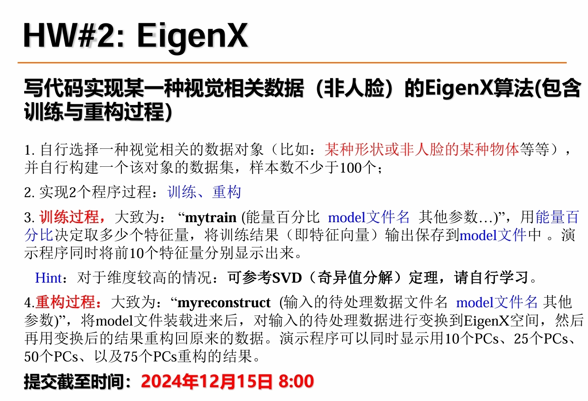
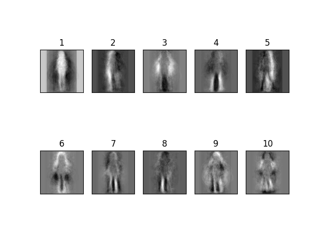
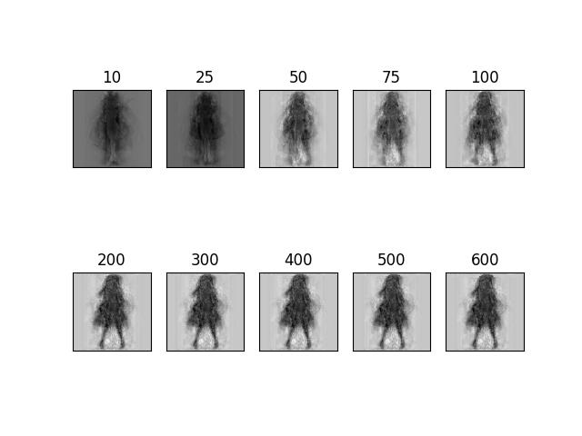
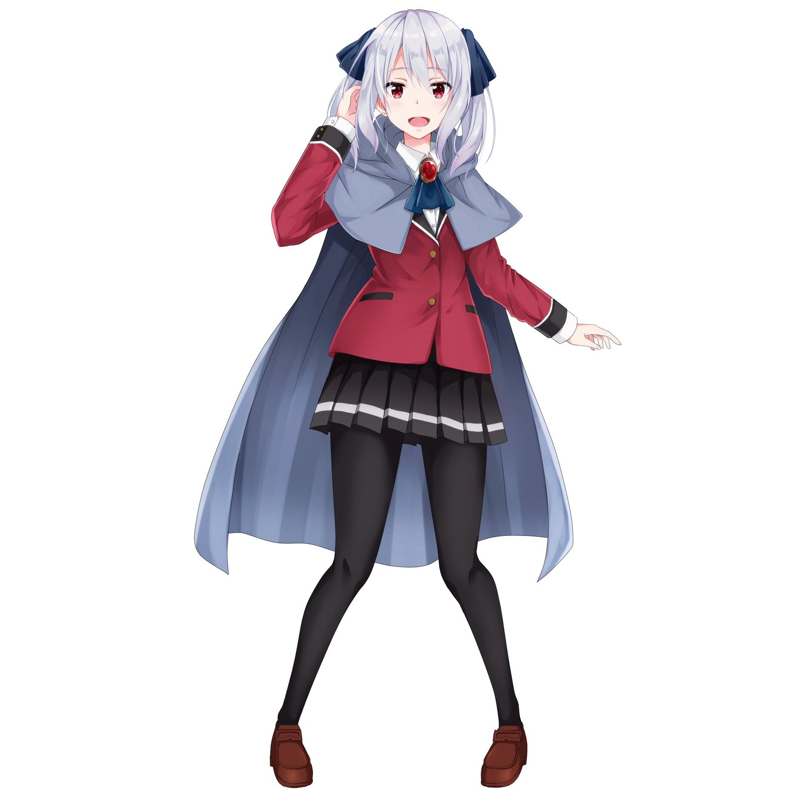
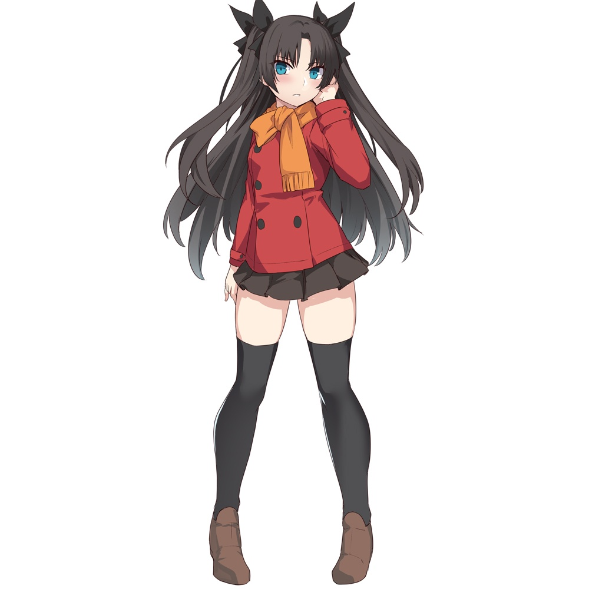
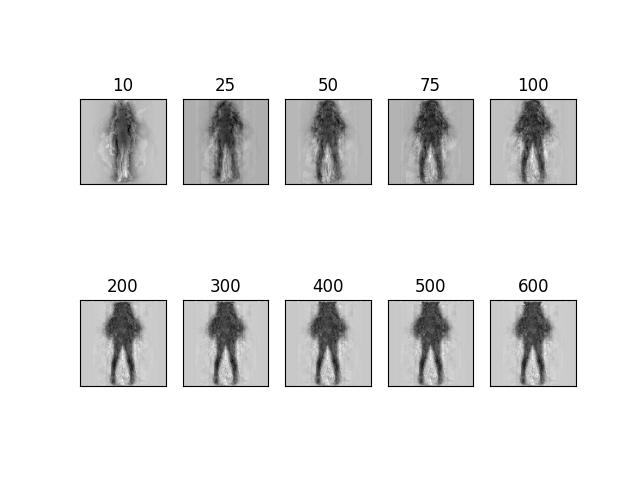

# HW2: EigenX

## 作业要求



## 运行

### 环境

```bash
python==3.9.18
opencv-python==4.10.0.84
numpy==1.26.4
torch==2.2.0
```

### 运行

```bash
cd hw2
python download_data.py
python main.py
```


## 实现

### 数据集

- 使用了一个动漫人物全身像数据集[Fullbody Anime Girls Datasets for Gans](https://www.kaggle.com/datasets/hirunkulphimsiri/fullbody-anime-girls-datasets)

- 随机抽取ultraclean_256中的少量图像作为training set

- 抽取两张图展示

- 

  

### 训练

#### 获取平均图


#### Top10 特征向量

- 使用了SVD分解，放到GPU里算来加速

    ```python
    vec_norm = torch.tensor(vec_array - avg_vec).cuda()
    u, s, v = torch.linalg.svd(vec_norm)
    eigenvecs = v.cpu().numpy()[:int(p * len(s))]
    ```

- 结果


### 重构

- 首先将原图project到特征向量张成的空间，再Top PCs个特征向量来重建图，

  ```python
  vec = (torch.tensor(self.img2vec(img)).cuda() -
             self.avg_vec).unsqueeze(0)  # [1, h*w]
  
  v_k = self.v[:, :k]
  vec_encode = torch.einsum('mn,nk -> mk', vec, v_k)
  vec_decode = torch.einsum('mk,kn -> mn', vec_encode, v_k.T)
  
  img_recon = (vec_decode + self.avg_vec).cpu().numpy().reshape(
  self.img_shape)
  ```

  

- 结果

  

  

  